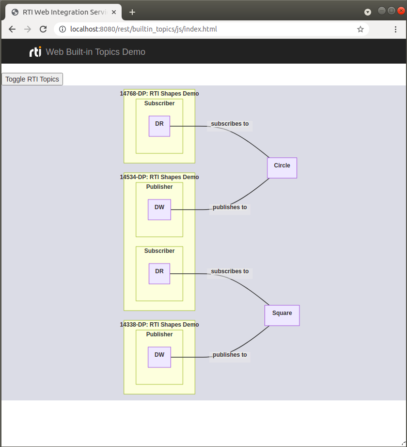

# Built-in Topics Demo
This example illustrates how to read discovery information using _RTI Web
Integration Service_. The discovered entities are drawn on the browser using
Mermaid—a JavaScript framework to easily draw diagrams.



## Running the Example
To run this example, execute _Web Integration Service_, _RTI Shapes Demo_, and
the JavaScript client as follows.

### Running Web Integration Service
To run the example, open a terminal and enter the following command:

```
$NDDSHOME/bin/rtiwebintegrationservice \
  -cfgFile /path/to/examples/parent/rest/builtin_topics/builtin_topics.xml \
  -cfgName builtinTopicsDemo \
  -enableKeepAlive yes \
  -documentRoot /path/to/examples/parent \
  -enableBuiltinTopics
```

Where:

* The ``-cfgFile`` argument loads the appropriate configuration file
into _Web Integration Service_.
* The ``-cfgName`` argument specifies the configuration to be instantiated—in
this case ```builtinTopicsDemo```—which starts the ``BuiltinTopicsDemoApp``.
This application instantiates a _DomainParticipant_ with the built-in
_DataReaders_ enabled in order to recieve discovery information (participant
data, publication data and subscription data)
* The ``-documentRoot`` argument specifies the folder that _Web
Integration Service's_ web server will provide when accessing the default URL.
That is ``http://<hostname>:8080``. This specific example can then be found
under ``http://<hostname>:8080/rest/builtin_topics/js``.
* The ``-enablekeepAlive`` argument configures the service to keep open the
underlying TCP connection between client and server between subsequent requests
and responses when possible.
* The ``-enableBuiltinTopics`` argument configures the service to accept HTTP
petitions in order to use the built-in topics.

### Running RTI Shapes Demo
Once you have started _Web Integration Service_, you can open _RTI Shapes
Demo_ and (optionally) start publishing shapes or subscribing to shapes.

### Running Built-in Topics Demo JavaScript Client
Open a browser and navigate to
``http://<hostname>:8080/rest/builtin_topics/js``. You will find there all the
entities discovered through the discovery process (even the internal _RTI
Shapes Demo_ entities).
